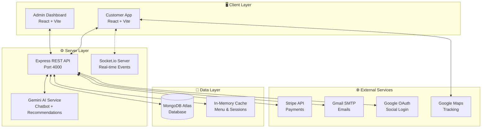
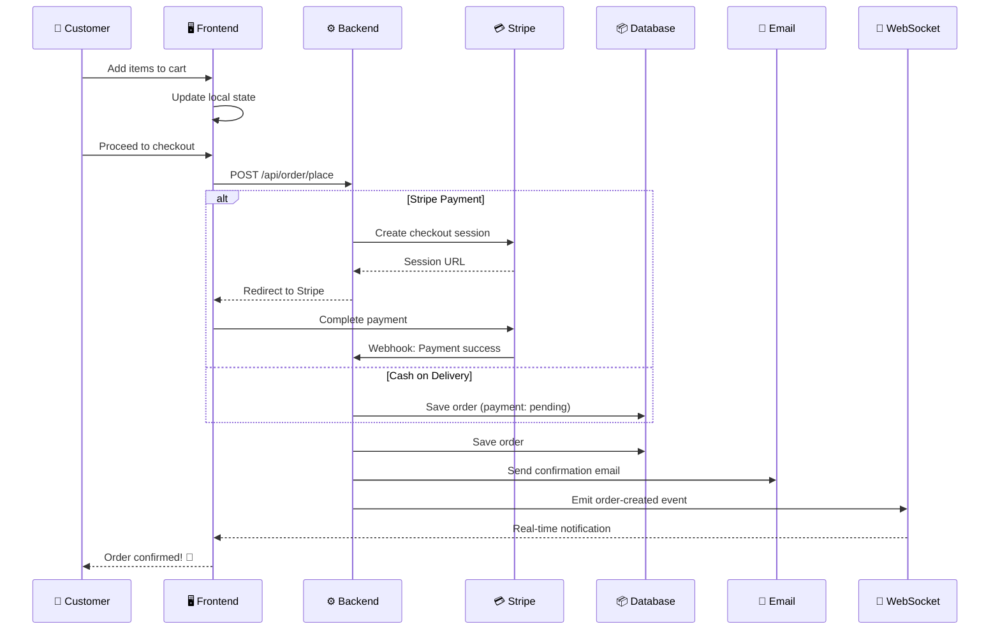
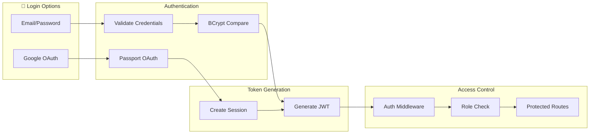

<p align="center">
  
</p>

<h1 align="center">🍅 TOMATO - Full-Stack Food Delivery Platform</h1>

<p align="center">
  <strong>A production-ready food delivery application built with the MERN stack, featuring real-time order tracking, AI-powered recommendations, and secure payment processing.</strong>
</p>

<p align="center">
  
  
  
  
  
  
</p>

<p align="center">
  <a href="#-features">Features</a> •
  <a href="#-tech-stack">Tech Stack</a> •
  <a href="#-architecture">Architecture</a> •
  <a href="#-installation">Installation</a> •
  <a href="#-api-documentation">API Docs</a>
</p>

---

## 🎯 Project Overview

**TOMATO** is a comprehensive food delivery platform that demonstrates expertise in full-stack development, real-time systems, payment integration, and AI implementation. The application provides three distinct interfaces:

| Interface | Description | Port |
|-----------|-------------|------|
| 🛒 **Customer App** | Browse menu, order food, track deliveries | 5173 |
| 👨‍💼 **Admin Dashboard** | Manage orders, menu items, and view analytics | 5175 |
| ⚙️ **Backend API** | RESTful API with WebSocket support | 4000 |

---

## ✨ Features

### 🔐 Authentication & Security
- **JWT-based Authentication** - Secure token-based auth with role management
- **Google OAuth 2.0** - One-click social login integration
- **Password Hashing** - BCrypt with configurable salt rounds
- **Protected Routes** - Middleware-based route protection

### 🛒 E-Commerce Features
- **Dynamic Menu** - Category-based food browsing with filters
- **Shopping Cart** - Persistent cart with real-time updates
- **Multiple Payment Options**:
  - 💳 Stripe Payment Gateway (Cards)
  - 💵 Cash on Delivery (COD)
- **Order Management** - Complete order lifecycle handling

### 📍 Real-Time Delivery Tracking
- **Live GPS Tracking** - Google Maps integration with driver location
- **WebSocket Updates** - Real-time status via Socket.io
- **Delivery Partner Assignment** - Automated partner matching
- **Status Timeline** - Visual order progress tracking

### 🤖 AI-Powered Features
- **AI Chatbot** - Gemini AI-powered food assistant
  - Menu recommendations
  - Order history queries
  - Natural language understanding
- **Smart Recommendations**:
  - 🔥 Trending items
  - ⏰ Time-based suggestions (Breakfast/Lunch/Dinner)
  - 🎯 Personalized picks based on order history

### 📧 Notifications
- **Email Notifications** (Nodemailer + Gmail)
  - Order confirmation
  - Status updates
  - Delivery notifications
- **In-App Notifications** - Real-time notification bell

### 🎨 UI/UX Features
- **Dark/Light Mode** - Theme toggle with persistence
- **Responsive Design** - Mobile-first approach
- **Modern Animations** - Smooth transitions and micro-interactions

---

## 🛠️ Tech Stack

### Frontend
| Technology | Purpose |
|------------|---------|
|  | UI Library |
|  | Build Tool |
|  | Navigation |
|  | HTTP Client |
|  | Real-time Updates |
|  | Map Integration |

### Backend
| Technology | Purpose |
|------------|---------|
|  | Runtime Environment |
|  | Web Framework |
|  | Database |
|  | ODM |
|  | Authentication |
|  | OAuth Strategy |

### Integrations
| Service | Purpose |
|---------|---------|
|  | Payment Processing |
|  | AI Chatbot |
|  | Email Notifications |
|  | Social Login |

---

## 🏗️ Architecture

### System Architecture



### Order Flow



### Authentication Flow



---

## 📁 Project Structure

```
Food-Delivery-MAIN1/
├── 📂 frontend/                 # Customer-facing React app
│   ├── src/
│   │   ├── components/          # Reusable UI components
│   │   │   ├── Chatbot/         # AI-powered chatbot
│   │   │   ├── Maps/            # Google Maps integration
│   │   │   ├── Notifications/   # Notification bell
│   │   │   └── Food/            # Food item cards & carousel
│   │   ├── pages/               # Route pages
│   │   │   ├── Home/            # Landing page
│   │   │   ├── Cart/            # Shopping cart
│   │   │   ├── PlaceOrder/      # Checkout (Stripe/COD)
│   │   │   ├── MyOrders/        # Order history
│   │   │   └── OrderTracking/   # Live GPS tracking
│   │   ├── context/             # React Context (Store, Theme)
│   │   └── hooks/               # Custom hooks
│   └── .env.example             # Environment template
│
├── 📂 admin/                    # Admin dashboard React app
│   ├── src/
│   │   ├── components/          # Admin UI components
│   │   └── pages/
│   │       ├── Orders/          # Order management
│   │       ├── Add/             # Add food items
│   │       └── List/            # Menu management
│   └── .env.example
│
├── 📂 backend/                  # Express.js API server
│   ├── config/
│   │   ├── db.js                # MongoDB connection
│   │   └── passport.js          # OAuth strategies
│   ├── controllers/             # Route handlers
│   │   ├── orderController.js   # Order CRUD + Stripe
│   │   ├── chatbotController.js # AI chatbot logic
│   │   └── deliveryController.js# Delivery tracking
│   ├── models/                  # Mongoose schemas
│   ├── routes/                  # API routes
│   ├── services/
│   │   └── chatbotService.js    # Gemini AI integration
│   ├── websocket/
│   │   └── socket.js            # Socket.io events
│   ├── middleware/
│   │   └── auth.js              # JWT verification
│   └── .env.example             # Environment template
│
└── 📄 README.md                 # You are here!
```

---

## ⚡ Installation

### Prerequisites
- Node.js 18+ 
- MongoDB Atlas account
- Stripe account
- Google Cloud Console project (OAuth + Maps)
- Gmail account (for SMTP)
- Gemini AI API key

### 1. Clone the Repository
```bash
git clone https://github.com/PAMIDIROHIT/Food-Delivery-MAIN1.git
cd Food-Delivery-MAIN1
```

### 2. Install Dependencies
```bash
# Backend
cd backend && npm install

# Frontend
cd ../frontend && npm install

# Admin
cd ../admin && npm install
```

### 3. Environment Setup

Copy the example files and fill in your credentials:

```bash
# Backend
cp backend/.env.example backend/.env

# Frontend  
cp frontend/.env.example frontend/.env
```

**Backend `.env` configuration:**
```env
JWT_SECRET=your_super_secret_jwt_key
SALT=10
MONGO_URL=mongodb+srv://...
STRIPE_SECRET_KEY=sk_test_...
GEMINI_API_KEY=your_gemini_key
GOOGLE_CLIENT_ID=your_client_id
GOOGLE_CLIENT_SECRET=your_client_secret
EMAIL_USER=your@gmail.com
EMAIL_PASSWORD=your_app_password
```

### 4. Start the Application

```bash
# Terminal 1: Backend (Port 4000)
cd backend && npm run server

# Terminal 2: Frontend (Port 5173)
cd frontend && npm run dev

# Terminal 3: Admin (Port 5175)
cd admin && npm run dev
```

---

## 📡 API Documentation

### Authentication Endpoints
| Method | Endpoint | Description |
|--------|----------|-------------|
| POST | `/api/user/register` | Register new user |
| POST | `/api/user/login` | Login with email/password |
| GET | `/api/auth/google` | Initiate Google OAuth |
| GET | `/api/auth/google/callback` | OAuth callback |

### Order Endpoints
| Method | Endpoint | Description |
|--------|----------|-------------|
| POST | `/api/order/place` | Create new order |
| POST | `/api/order/userorders` | Get user's orders |
| POST | `/api/order/status` | Update order status |
| POST | `/api/order/verify` | Verify Stripe payment |

### Food Endpoints
| Method | Endpoint | Description |
|--------|----------|-------------|
| GET | `/api/food/list` | Get all food items |
| POST | `/api/food/add` | Add new food item (Admin) |
| POST | `/api/food/remove` | Remove food item (Admin) |

### Delivery Endpoints
| Method | Endpoint | Description |
|--------|----------|-------------|
| GET | `/api/delivery/status/:orderId` | Get delivery status |
| POST | `/api/delivery/simulate/:orderId` | Simulate delivery (Demo) |

### AI Endpoints
| Method | Endpoint | Description |
|--------|----------|-------------|
| POST | `/api/chat/message` | Send message to AI chatbot |
| GET | `/api/recommendations/trending` | Get trending items |
| GET | `/api/recommendations/personalized` | Get personalized picks |

---

## 🖼️ Screenshots

<details>
<summary>Click to view screenshots</summary>

### Home Page


### Menu


### Shopping Cart


### Authentication


</details>

---

## 🔮 Future Enhancements

- [ ] Mobile app (React Native)
- [ ] Multi-restaurant support
- [ ] Loyalty points system
- [ ] Advanced analytics dashboard
- [ ] Push notifications (FCM)
- [ ] Multi-language support

---

## 👤 Author

**PAMIDI ROHIT**

[](https://github.com/PAMIDIROHIT)
[](https://linkedin.com/in/pamidirohit)

---

## 📄 License

This project is open source and available under the [MIT License](LICENSE).

---

<p align="center">
  <strong>⭐ If you found this project helpful, please give it a star!</strong>
</p>

<p align="center">
  Made with ❤️ and lots of ☕
</p>
